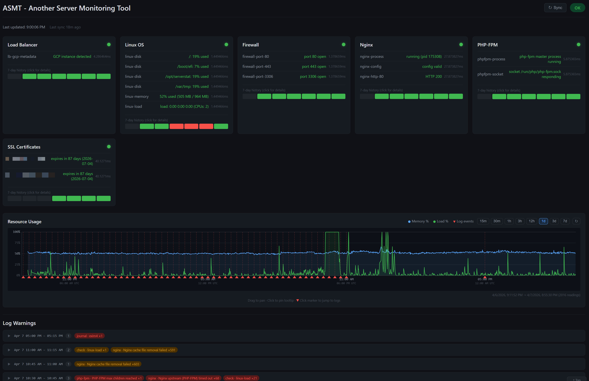

# ASMT: Another Server Monitoring Tool

[](https://github.com/minspresso/asmt/actions/workflows/ci.yml)
[](LICENSE)
[](https://goreportcard.com/report/github.com/minspresso/asmt)



*Live dashboard on a production Debian VM. Every panel is real data; no synthetic placeholders. Two SSL certificate rows are redacted; everything else is exactly what an operator sees.*

A lightweight Linux server monitoring tool built in Go. Single static binary (~8 MB), zero runtime dependencies, ~13 MB RSS at runtime. Auto-detects services and works across every major Linux distribution.

> **Why another one?** ASMT is designed to be a *smart lens on top of the OS journal*, not a replacement for it. It earns its existence by making existing truth easier to see, and it does so in roughly **one tenth the memory** of a typical agent. See [LEARNINGS.md](LEARNINGS.md) for the design story.

## What it does

ASMT runs as a background service and continuously checks the health of your server's components. It exposes a live web dashboard and a JSON API so you can see the current state of everything at a glance.

### What it monitors

| Component | Checks performed |
|-----------|-----------------|
| **Linux OS** | Disk usage, memory usage, load average |
| **Nginx** | Process running (PID + signal 0), config valid (`nginx -t`), HTTP probe |
| **Apache** | Process running, config valid (`apachectl -t`), HTTP probe |
| **PHP-FPM** | Process in `/proc`, socket/port responding |
| **MariaDB** | Connection alive, `SELECT 1`, thread count |
| **PostgreSQL** | Connection alive, `SELECT 1`, active connection count |
| **Redis** | PING/PONG over raw TCP, optional AUTH |
| **WordPress** | Site HTTP response, wp-cron endpoint, REST API |
| **Custom HTTP endpoints** | Status code, optional body substring, custom headers |
| **Firewall** | TCP dial to configured ports on localhost |
| **GCP Load Balancer** | Metadata server reachable, LB path probe |
| **Log watcher** | Tails log files, matches 26 known error patterns with mitigation advice |

### Endpoints

| Endpoint | Purpose |
|----------|---------|
| `GET /` | Web dashboard (status refreshes every 5 s; logs refresh immediately on status change and every 15 min otherwise) |
| `GET /api/status` | Full JSON status of all components |
| `GET /api/logs` | Recent log warnings with mitigation advice |
| `GET /healthz` | Load balancer health check (`200 OK` or `503`) |

### Supported Linux distributions

Debian, Ubuntu, Linux Mint, RHEL, CentOS, Rocky Linux, AlmaLinux, Fedora, Arch, Manjaro, Alpine, openSUSE, SLES.

### Alerts

Supports log alerting, webhook (POST JSON), and email (SMTP) on status transitions.

---

## Install from a release (no Go required)

Run this one-liner on your server. It auto-detects your CPU architecture, fetches the latest release, and installs everything:

```bash
curl -sSL https://raw.githubusercontent.com/minspresso/asmt/main/scripts/get.sh | sudo bash
```

That's it. The installer:
- Detects your CPU architecture (`amd64` or `arm64`) automatically
- Fetches the latest release version from GitHub
- Downloads the correct binary
- Detects your distro, HTTP server (nginx/Apache), and init system (systemd/OpenRC)
- Installs the binary to `/opt/serverstat/`
- Generates a starter `config.yaml` tailored to what it finds on your system
- Registers and enables the service

After installing:

```bash
# Edit the config
sudo nano /opt/serverstat/config.yaml

# Set secrets in the environment file (persists across reboots, chmod 600)
sudo nano /opt/serverstat/env
# Example contents:
#   MARIADB_DSN=monitor:password@tcp(127.0.0.1:3306)/mysql
#   REDIS_PASSWORD=secret

# Start the service (systemd)
sudo systemctl enable --now serverstat

# Or on OpenRC (Alpine)
sudo rc-update add serverstat default
sudo rc-service serverstat start
```

Secrets use `${ENV_VAR}` expansion in `config.yaml`. The environment file at `/opt/serverstat/env` is loaded by systemd via `EnvironmentFile=`, so values persist across reboots. The file is created with `chmod 600` (root-only readable).

Dashboard is at `http://localhost:8080` (localhost only by default).

---

## Install from source (requires Go 1.22+)

```bash
git clone https://github.com/minspresso/asmt.git
cd asmt

make build          # produces ./serverstat binary
sudo bash scripts/install.sh
```

Or build and install in one step:

```bash
make install        # builds if needed, then runs install.sh
```

To cross-compile for a remote server:

```bash
make build-amd64    # Linux amd64
make build-arm64    # Linux arm64
```

Then copy the files and install remotely:

```bash
scp serverstat scripts/install.sh scripts/uninstall.sh config.yaml user@server:~/
ssh user@server 'sudo bash install.sh'
```

---

## Uninstall

```bash
# If installed via one-liner
curl -sSL https://raw.githubusercontent.com/minspresso/asmt/main/scripts/uninstall.sh | sudo bash

# If installed from source (interactive)
sudo bash scripts/uninstall.sh

# Non-interactive
sudo bash scripts/uninstall.sh -y

# Via make
make uninstall
```

Removes the binary, config, and service files from the system.

---

## Configuration

The config file lives at `/opt/serverstat/config.yaml` after install. A reference copy is in `config.yaml` at the root of this repo.

Sensitive values use `${ENV_VAR}` expansion. Never hardcode secrets in `config.yaml`:

```yaml
mariadb:
  dsn: "${MARIADB_DSN}"
redis:
  password: "${REDIS_PASSWORD}"
alerts:
  webhook:
    url: "${WEBHOOK_URL}"
```

Define the actual values in `/opt/serverstat/env` (one `KEY=value` per line, no quotes needed):

```bash
MARIADB_DSN=monitor:password@tcp(127.0.0.1:3306)/mysql
REDIS_PASSWORD=secret
WEBHOOK_URL=https://hooks.example.com/alert
```

This file is loaded by systemd on every service start and persists across reboots. After editing, restart: `sudo systemctl restart serverstat`.

Set language to `"en"` (English, default) or `"ko"` (Korean).

---

## Build a distributable archive

```bash
make dist                     # current platform
make dist GOARCH=arm64        # cross-compile for ARM
```

Produces `serverstat-VERSION-linux-ARCH.tar.gz` containing the binary, scripts, config, and README.

---

## Resource usage

| Metric | Value |
|--------|-------|
| Binary size | ~8 MB (stripped, static, no CGO) |
| RSS at runtime (typical) | ~13 MB steady, ~16 MB peak |
| GOMEMLIMIT (soft GC ceiling) | 64 MiB |
| CPU | Negligible (checks run every 30 s) |

Numbers above are `VmRSS` and `VmHWM` from `/proc/PID/status` on a production Debian VM running nginx, WordPress, MariaDB, and PHP-FPM.

A "soft GC ceiling" of 64 MiB does **not** mean ASMT reserves 64 MiB. The Go runtime uses it as a hint to garbage-collect more aggressively as the heap approaches that number. Idle RSS stays around 13 MB. The headroom only matters during a crisis (see the "memory ceiling lesson" in [LEARNINGS.md](LEARNINGS.md)).

> **Note on `systemctl status serverstat`.** systemd may report a much larger number (e.g. `Memory: 65M`). That is the service's *cgroup* memory, which includes **kernel pagecache** for the log files ASMT tails. That memory is reclaimable on demand and is not "used by" the process in any meaningful sense. The process-level RSS is what the table above quotes, and it is what the `ps`, `top`, and `/proc/PID/status` numbers agree on.

---

## Project layout

```
*.go              All source (flat package main, ~3500 lines)
lang/             Translation YAML files (en, ko)
web/              Dashboard HTML (embedded at build time)
scripts/
  get.sh          One-liner: detects arch, downloads latest release, installs
  install.sh      Installs from a local binary (used by get.sh and make install)
  uninstall.sh    Removes binary, config, and service files
config.yaml       Reference configuration
Makefile
```

---

## Security

Found a vulnerability? Please **do not** open a public issue. See [SECURITY.md](SECURITY.md) for the private disclosure process.

## Contributing

Pull requests are welcome. Please read [CONTRIBUTING.md](CONTRIBUTING.md) before opening one. It covers the coding conventions, the test/lint commands CI runs, and the design principles ASMT holds itself to.

## License

[GNU Affero General Public License v3.0](LICENSE) (AGPL-3.0)

You are free to use, modify, and distribute this software, but any modified version (including use over a network) must also be released under AGPL-3.0 with its source code made available. It cannot be used in closed-source or proprietary products without a separate commercial agreement.
